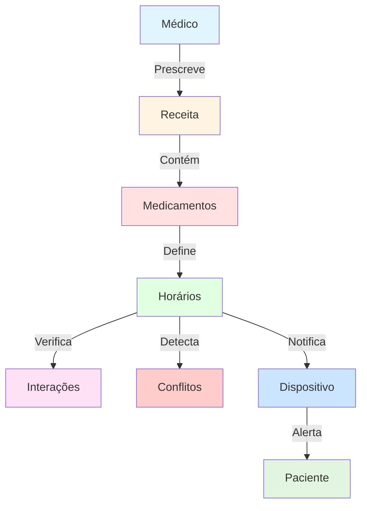

# Diagrama Entidade-Relacionamento (ER) - MedTime

## Diagrama ER Completo

```mermaid
erDiagram
    %% ========================================
    %% TABELAS DE AUTENTICAÇÃO
    %% ========================================
    
    users ||--o{ sessions : "possui"
    users ||--o{ refresh_tokens : "possui"
    users ||--o| user_profiles : "possui"
    users ||--o{ medicos : "pode_ser"
    users ||--o{ pacientes : "gerencia"
    users ||--o{ receitas : "cria"
    users ||--o{ receita_medicamentos : "gerencia"
    users ||--o{ receita_horarios : "define"
    users ||--o{ conflitos_horario : "monitora"
    users ||--o{ dispositivos : "possui"
    users ||--o{ paciente_celulares : "cadastra"
    
    sessions ||--o{ refresh_tokens : "gera"
    
    users {
        bigint id PK
        varchar email UK "Email único"
        varchar password "Senha criptografada"
        varchar role "user ou admin"
        timestamp created_at
        timestamp updated_at
    }
    
    sessions {
        bigint id PK
        bigint user_id FK
        varchar ip "IP da sessão"
        varchar user_agent "Navegador/dispositivo"
        timestamp created_at
        timestamp updated_at
        timestamp refresh_at
    }
    
    refresh_tokens {
        bigint id PK
        bigint user_id FK
        text token "Token criptografado"
        bigint session_id FK
        boolean revoked "Token revogado"
        timestamp expires_at
        timestamp created_at
        timestamp updated_at
    }
    
    user_passcode {
        bigint id PK
        varchar passcode "Código verificação"
        varchar passcode_type "EMAIL, SMS"
        varchar pass_object "Email/telefone"
        timestamp valid_until "Expira em 3min"
        integer retry_count
        boolean revoked
        timestamp created_at
        timestamp updated_at
    }
    
    %% ========================================
    %% TABELAS DE PERFIL E CADASTROS
    %% ========================================
    
    prefeituras ||--o{ user_profiles : "vincula"
    prefeituras ||--o{ medicamentos : "cadastra"
    prefeituras ||--o{ pacientes : "atende"
    prefeituras ||--o{ receitas : "emite"
    prefeituras ||--o{ receita_medicamentos : "dispensa"
    prefeituras ||--o{ historico_medicamentos : "audita"
    
    user_profiles {
        bigint id PK
        bigint user_id FK UK
        varchar nome_completo
        varchar tipo_usuario "paciente, profissional, acs, gestor, admin"
        bigint id_prefeitura FK
        varchar unidade_saude
        varchar cargo
        varchar telefone
        text avatar_url
        jsonb preferencias_notificacao
        timestamp created_at
        timestamp updated_at
    }
    
    prefeituras {
        bigint id PK
        varchar nome "Nome oficial"
        varchar cnpj UK "CNPJ único"
        varchar apelido
        boolean ativo
        timestamp created_at
        timestamp updated_at
    }
    
    %% ========================================
    %% TABELAS DE PACIENTES
    %% ========================================
    
    pacientes ||--o{ paciente_celulares : "possui"
    pacientes ||--o{ dispositivos : "usa"
    pacientes ||--o{ receitas : "recebe"
    pacientes ||--o{ conflitos_horario : "tem"
    
    pacientes {
        bigint id PK
        bigint user_id FK
        bigint id_prefeitura FK
        varchar cartao_sus "Apenas números"
        varchar cpf "11 dígitos"
        varchar nome
        date data_nascimento
        varchar celular
        boolean celular_validado
        boolean app_instalado
        boolean consentimento_lgpd
        timestamp data_consentimento
        varchar versao_termo_consentimento
        boolean ativo
        timestamp created_at
        timestamp updated_at
    }
    
    paciente_celulares {
        bigint id PK
        bigint user_id FK
        bigint id_paciente FK
        varchar modelo
        varchar marca
        varchar numero_serie
        varchar numero_contato
        varchar tipo_celular "proprio ou cuidador"
        varchar nome_cuidador
        boolean ativo
        timestamp created_at
        timestamp updated_at
    }
    
    dispositivos {
        bigint id PK
        bigint user_id FK
        bigint id_paciente FK
        varchar device_id UK
        varchar device_name
        varchar platform "android ou ios"
        varchar app_version
        varchar os_version
        timestamp ultima_sincronizacao
        text token_push
        boolean ativo
        timestamp created_at
        timestamp updated_at
    }
    
    %% ========================================
    %% TABELAS DE MÉDICOS E MEDICAMENTOS
    %% ========================================
    
    medicos ||--o{ receitas : "prescreve"
    
    medicos {
        bigint id PK
        bigint user_id FK
        varchar nome
        varchar crm "Apenas números"
        varchar especialidade
        boolean ativo
        timestamp created_at
        timestamp updated_at
    }
    
    medicamentos ||--o{ receita_medicamentos : "prescrito_em"
    medicamentos ||--o{ interacoes_medicamentosas : "interage_com_1"
    medicamentos ||--o{ interacoes_medicamentosas : "interage_com_2"
    medicamentos ||--o{ historico_medicamentos : "historico"
    
    medicamentos {
        bigint id PK
        bigint id_prefeitura FK
        varchar nome
        text descricao
        text imagem_url
        varchar principio_ativo
        varchar concentracao "Ex: 500mg"
        varchar forma_farmaceutica "Comprimido, cápsula"
        boolean ativo
        timestamp created_at
        timestamp updated_at
    }
    
    interacoes_medicamentosas {
        bigint id PK
        bigint id_medicamento_1 FK
        bigint id_medicamento_2 FK
        varchar severidade "leve, moderada, grave"
        text descricao
        text recomendacao
        boolean ativo
        timestamp created_at
        timestamp updated_at
    }
    
    historico_medicamentos {
        bigint id PK
        bigint id_medicamento FK
        bigint id_prefeitura FK
        varchar nome_anterior
        varchar nome_novo
        varchar campo_alterado
        text valor_anterior
        text valor_novo
        bigint alterado_por FK
        timestamp created_at
    }
    
    %% ========================================
    %% TABELAS DE RECEITAS E HORÁRIOS
    %% ========================================
    
    receitas ||--o{ receita_medicamentos : "contém"
    
    receitas {
        bigint id PK
        bigint user_id FK
        bigint id_paciente FK
        bigint id_prefeitura FK
        bigint id_medico FK
        date data_receita
        timestamp data_registro
        varchar origem_receita
        varchar subgrupo_origem
        text observacao
        varchar tipo_prescritor
        varchar num_notificacao
        varchar status "ativa, concluida, cancelada"
        timestamp created_at
        timestamp updated_at
    }
    
    receita_medicamentos ||--o{ receita_horarios : "define_horarios"
    
    receita_medicamentos {
        bigint id PK
        bigint user_id FK
        bigint id_receita FK
        bigint id_medicamento FK
        bigint id_prefeitura FK
        numeric quantidade_total
        numeric quantidade_minima_calculada
        integer frequencia_dia ">=1"
        integer duracao_dias ">=1"
        integer dias_dispensar
        text observacao
        text posologia
        varchar via_administracao
        varchar status "ativo, concluido, cancelado"
        date data_inicio
        date data_fim
        timestamp created_at
        timestamp updated_at
    }
    
    receita_horarios ||--o{ conflitos_horario : "conflita_1"
    receita_horarios ||--o{ conflitos_horario : "conflita_2"
    
    receita_horarios {
        bigint id PK
        bigint user_id FK
        bigint id_receita_medicamento FK
        time horario
        date data_inicio
        date data_fim
        boolean domingo
        boolean segunda
        boolean terca
        boolean quarta
        boolean quinta
        boolean sexta
        boolean sabado
        text observacao
        varchar dias_semana "Legado"
        boolean ativo
        timestamp created_at
        timestamp updated_at
    }
    
    %% ========================================
    %% TABELA DE CONFLITOS
    %% ========================================
    
    conflitos_horario {
        bigint id PK
        bigint user_id FK
        bigint id_paciente FK
        bigint id_horario_1 FK
        bigint id_horario_2 FK
        date data_conflito
        time horario_conflito
        varchar severidade "leve, moderada, grave"
        boolean resolvido
        text observacao
        timestamp created_at
        timestamp updated_at
    }
```

## Legenda de Relacionamentos

| Símbolo | Significado |
|---------|-------------|
| `||--o{` | Um para muitos (1:N) |
| `||--o|` | Um para um (1:1) |
| `}o--o{` | Muitos para muitos (N:M) |
| `PK` | Chave Primária (Primary Key) |
| `FK` | Chave Estrangeira (Foreign Key) |
| `UK` | Chave Única (Unique Key) |

## Grupos Funcionais

### 🔐 Autenticação e Segurança
- `users` - Usuários do sistema
- `sessions` - Sessões ativas
- `refresh_tokens` - Tokens de renovação
- `user_passcode` - Códigos de verificação

### 👤 Perfis e Cadastros
- `user_profiles` - Perfis detalhados
- `prefeituras` - Municípios
- `pacientes` - Pacientes SUS
- `medicos` - Médicos prescritores

### 📱 Dispositivos e Contatos
- `paciente_celulares` - Celulares vinculados
- `dispositivos` - Dispositivos móveis

### 💊 Medicamentos
- `medicamentos` - Catálogo de medicamentos
- `interacoes_medicamentosas` - Interações conhecidas
- `historico_medicamentos` - Auditoria de alterações

### 📋 Receitas e Prescrições
- `receitas` - Receitas médicas
- `receita_medicamentos` - Medicamentos prescritos
- `receita_horarios` - Horários de tomada

### ⚠️ Monitoramento
- `conflitos_horario` - Conflitos detectados

## Fluxo de Dados Principal



## Índices Principais

### Índices de Performance
- `users.email` (UNIQUE)
- `pacientes.cartao_sus`
- `pacientes.cpf`
- `medicos.crm`
- `receita_horarios(user_id, horario)` - Consultas de agenda
- `receita_horarios(data_inicio, data_fim)` - Filtros de período

### Índices de Relacionamento
- Todas as chaves estrangeiras possuem índices
- Campos `user_id` indexados em todas as tabelas de dados

### Índices de Status
- `ativo` em tabelas com soft delete
- `status` em receitas e medicamentos
- `resolvido` em conflitos

## Constraints e Validações

### Validações de Formato
- `cartao_sus`: apenas números
- `cpf`: 11 dígitos numéricos
- `crm`: apenas números
- `cnpj`: formato válido

### Validações de Domínio
- `tipo_usuario`: paciente, profissional_saude, acs, gestor_municipal, admin
- `tipo_celular`: proprio, cuidador
- `platform`: android, ios
- `severidade`: leve, moderada, grave
- `status`: ativa/ativo, concluida/concluido, cancelada/cancelado

### Validações Numéricas
- `frequencia_dia` ≥ 1
- `duracao_dias` ≥ 1

## Segurança e Permissões

### Row Level Security (RLS)
Todas as tabelas de dados implementam controle baseado em `user_id`:
- Usuários comuns: acesso apenas aos próprios dados
- Administradores: acesso total

### Tabelas Restritas (Admin Only)
- `users`
- `sessions`
- `refresh_tokens`
- `user_passcode`

## Auditoria e Rastreabilidade

Todas as tabelas possuem:
- `created_at` - Data de criação
- `updated_at` - Data da última modificação
- `ativo` - Soft delete (quando aplicável)

Tabela específica de auditoria:
- `historico_medicamentos` - Rastreia todas as alterações em medicamentos

## Conformidade LGPD

Campos específicos em `pacientes`:
- `consentimento_lgpd` - Aceite do termo
- `data_consentimento` - Data do aceite
- `versao_termo_consentimento` - Versão do termo aceito

---

**Gerado em**: Janeiro 2026  
**Versão**: 1.0  
**Total de Tabelas**: 17  
**Total de Relacionamentos**: 35+
